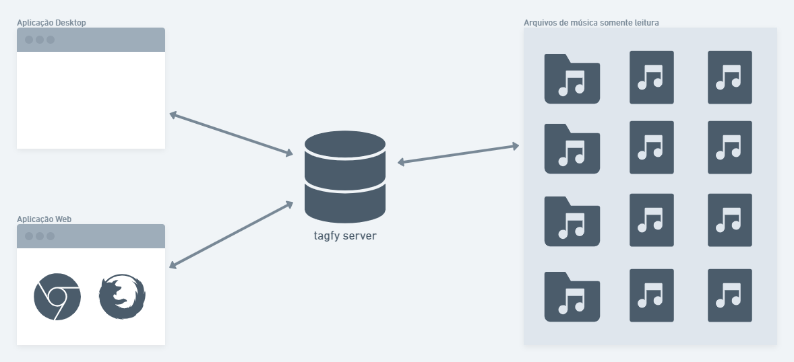

# tagfy

tagfy é uma API responsável por coletar as informações de arquivos de música (IDv3) e disponibiliza-las para edição e reprodução, sem que os arquivos originais sejam modificados.

## Problema

Imagine uma coleção de arquivos de música e muitos destes arquivos foram baixados da internet via torrent e pelo sentimento de colaboração, você decide manter esses torrents semeando para que outras pessoas possam baixar também porém isso impede que os arquivos sejam modificados. O grande problema disso que é divergências nas tags podem ocorrer, por exemplo:

## Solução

O tagfy foi criado para corrigir este problema, pois ele coleta as informações de todos os arquivos de áudio de um determinado diretório e armazena em um banco de dados para que possam ser modificados, junto com os seus respectivos caminhos para que eles possa ser reproduzidos.

Esta solução se aplica em qualquer caso em que os arquivos em questão não possam ser modificados.

## Arquitetura

## Dependências

 - express
 - mongoose
 - mongodb
 - npm
 - nodejs
 - nodemon
 - md5-file
 - music-metadata
 - cors
 - fs

## Instalação

### Preparar o ambiente
